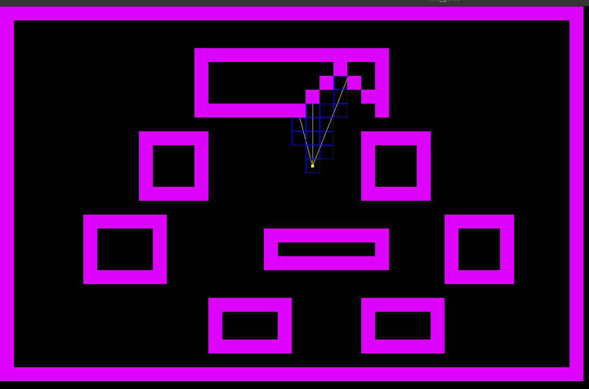

*This project has been created as part of the 42 curriculum by meelma and fmoulin.*

# cub3D

## Description

cub3D is a raycasting engine inspired by the classic 1992 game Wolfenstein 3D. The project generates a dynamic, first-person perspective view inside a maze, using the raycasting technique to create a pseudo-3D representation from a 2D map.

The program reads a `.cub` scene description file that defines wall textures, floor/ceiling colors, and the map layout. It then renders an interactive window where the player can navigate the maze using keyboard controls: WASD for movement and arrow keys for camera rotation.

This project was developed as a two-person collaboration. meelma handled the file parsing, map validation, and project integration, while fmoulin developed the rendering engine, player movement, and minimap.

` *** Screenshot of minimap *** `



### Features

- Raycasting-based 3D rendering with textured walls
- Four directional wall textures (North, South, East, West) loaded from `.xpm` files
- Configurable floor and ceiling colors via RGB values
- WASD movement with arrow key rotation
- Wall collision detection
- Minimap overlay with player position and ray visualization
- Comprehensive `.cub` file parsing with detailed error messages

## Instructions

### Prerequisites

- A Linux environment (developed and tested on Elementary OS / Ubuntu)
- `gcc`, `make`
- X11 development libraries: `sudo apt install libx11-dev libxext-dev`

### Compilation

```bash
git clone <repository-url>
cd cub3d
make
```

The Makefile will automatically download and compile MiniLibX if it is not already present.

### Usage

```bash
./cub3D path/to/map.cub
```

### Map file format

A `.cub` file contains texture paths, color definitions, and a map. Example:

```
NO ./textures/north.xpm
SO ./textures/south.xpm
WE ./textures/west.xpm
EA ./textures/east.xpm

F 220,100,0
C 225,30,0

111111
100001
10N001
100001
111111
```

Map characters: `1` (wall), `0` (floor), `N/S/E/W` (player spawn and facing direction). Spaces are valid and represent void areas. The map must be fully enclosed by walls.

## Technical Details: Parsing

The parsing module is responsible for reading, validating, and structuring all data from the `.cub` file before the rendering engine takes over.

### Architecture

The parsing pipeline follows this order:

1. **Argument validation** — checks argument count and `.cub` file extension
2. **File reading** — reads line by line using `get_next_line`, classifying each line by type (texture, color, map, empty, invalid)
3. **Texture parsing** — extracts and validates four directional texture paths, checks `.xpm` extension and file existence, rejects duplicates
4. **Color parsing** — extracts and validates RGB values for floor and ceiling, ensures each component is a pure number in the 0–255 range, rejects duplicates
5. **Map construction** — collects map lines into a linked list, converts to a 2D array
6. **Map validation** — verifies only valid characters are present, exactly one player exists, and the map is fully enclosed by walls
7. **Player initialization** — extracts player position and direction from the map, initializes the camera plane, replaces the player character with floor

### Map closure validation

The map closure check uses a multi-step approach:

- **Edge checks** verify that the first and last rows, as well as the first and last real characters of each row, are not walkable tiles
- **Flood fill from all walkable tiles** ensures every `0` and player tile is fully enclosed. The algorithm treats walls (`1`) and spaces as barriers, and returns an error if any walkable tile reaches the edge of a row (past its string length) or the edge of the map

This approach correctly handles irregular map shapes, maps with internal rooms, and maps with spaces between wall sections, as demonstrated by the subject's own example map.

### Error handling

All error messages are written to `stderr`. The parser provides specific error messages for each failure case, including invalid characters, missing or duplicate textures/colors, unclosed maps, and malformed color values. On error, all allocated memory is properly freed before exiting.

## Technical Details: Rendering & Raycasting

The rendering module is responsible for transforming the validated 2D map into a real-time pseudo-3D scene using a raycasting technique. It computes what the player sees by casting rays into the map and projecting the results onto the screen.

### Architecture

The rendering pipeline follows this order for each frame:

1. **Camera space computation** — converts each screen column into a ray direction using the camera plane
2. **Ray direction calculation** — combines player direction and camera plane to obtain the ray vector
3. **DDA initialization** — prepares stepping variables to traverse the grid efficiently
4. **DDA traversal** — steps through the map tile by tile until a wall is hit
5. **Distance calculation** — computes the perpendicular distance to avoid fish-eye distortion
6. **Projection** — determines the height and position of the wall slice on screen
7. **Texturing** — maps the correct texture pixels onto the wall slice
8. **Final rendering** — draws ceiling, wall, and floor for each column

---

### Player Direction (`dir`)

The player direction vector defines where the player is looking.

Stored in:

* `player.dir_x`
* `player.dir_y`

By convention:

* X axis points to the right
* Y axis points downward

Initial values depend on player orientation:

| Orientation | dir_x | dir_y |
| ----------- | ----- | ----- |
| East        | +1    | 0     |
| West        | -1    | 0     |
| South       | 0     | +1    |
| North       | 0     | -1    |

---

### Camera Plane (`plane`)

The camera plane defines the player's field of view (FOV). It is always perpendicular to the direction vector.

Stored in:

* `player.plane_x`
* `player.plane_y`

If:

dir = (dx, dy)

Then:

plane = (-dy, dx)

This guarantees orthogonality since their dot product equals zero.

The plane is scaled by a constant factor (`k ≈ 0.66`), which determines the FOV (≈ 66°), providing a natural perspective similar to Wolfenstein 3D.

---

### Camera Space (`cameraX`)

Each vertical column of the screen corresponds to a ray. The horizontal position is mapped to camera space using:

cameraX = 2 * x / WIDTH - 1

This produces:

* `-1` at the left edge
* `0` at the center
* `+1` at the right edge

---

### Ray Direction

For each column, the ray direction is computed as:

rayDir = dir + plane * cameraX

This creates a spread of rays covering the field of view.

---

### DDA (Digital Differential Analyzer)

The DDA algorithm determines which map cell a ray intersects first.

Instead of advancing pixel by pixel, DDA progresses **tile by tile**, ensuring accuracy and performance.

#### Initialization

* `mapX`, `mapY`: current tile position
* `deltaDistX`, `deltaDistY`: distance to cross one tile in each axis
* `stepX`, `stepY`: direction of movement in the grid
* `sideDistX`, `sideDistY`: distance to the first grid boundary

Delta distances are computed as:

deltaDistX = |1 / rayDirX|
deltaDistY = |1 / rayDirY|

#### Traversal loop

At each step:

if sideDistX < sideDistY
    move to next tile in X direction
else
    move to next tile in Y direction

The loop continues until a wall (`'1'`) is encountered.

---

### Perpendicular Distance (`perpWallDist`)

To avoid fish-eye distortion, the distance to the wall is corrected:

if vertical hit:
    perpWallDist = (mapX - posX + (1 - stepX) / 2) / rayDirX

if horizontal hit:
    perpWallDist = (mapY - posY + (1 - stepY) / 2) / rayDirY

This ensures consistent wall scaling regardless of ray angle.

---

### Wall Projection

The wall height on screen is computed as:

lineHeight = HEIGHT / perpWallDist

The vertical drawing limits are:

drawStart = -lineHeight / 2 + HEIGHT / 2
drawEnd   =  lineHeight / 2 + HEIGHT / 2

This centers the wall vertically on the screen.

---

### Texturing

To map textures onto walls:

1. Compute the exact hit position on the wall (`wallX`)
2. Convert it into a texture coordinate (`texX`)
3. Iterate vertically to compute `texY` using a step factor

Texture sampling is done per pixel:

color = texture[texX][texY]

This produces correctly scaled and oriented textures on each wall slice.

---

### Ceiling and Floor Rendering

For each column:

* Pixels above `drawStart` are filled with the ceiling color
* Pixels below `drawEnd` are filled with the floor color

---

### Summary

The rendering engine works by:

Casting rays → traversing the grid (DDA) → computing distance → projecting walls → applying textures → drawing the frame

This method provides a fast and efficient way to simulate a 3D environment using a 2D map, forming the core of classic raycasting engines.


### AI usage

AI was used during development as a code review aid. Specifically, it was used for:

- Generating test map files to cover edge cases in map validation
- Structuring the project's header files and Makefile organization

All code was written by the team members. AI was not used to generate the core logic of either the parsing or rendering modules.
